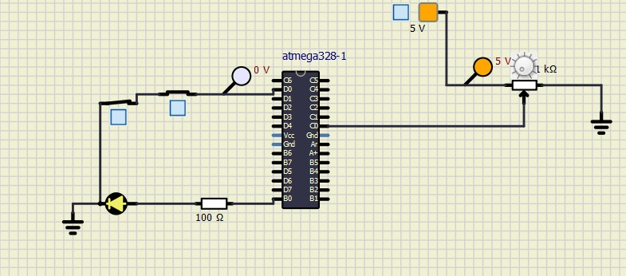
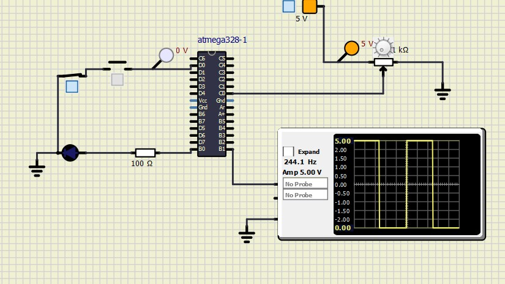
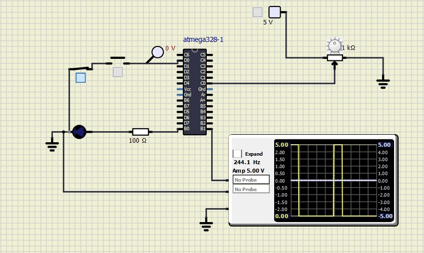

# Embedded C Programming with Continuous Integration and Code Quality
## LED Blinking 

### Activity1

|ON|OFF|
|:--:|:--:|
|||

### Activity2

|Diagram|
|:--:|
||

### Activity3

|CRO display|
|:--:|
||

### Activity4

||

#### CI and Code Quality

|Build|Cppcheck|Codacy|
|:--:|:--:|:--:|
|||

## Wiki Documentation
* System [  SETUP](https://github.com/sushmacharihar/Emb-C/wiki)
